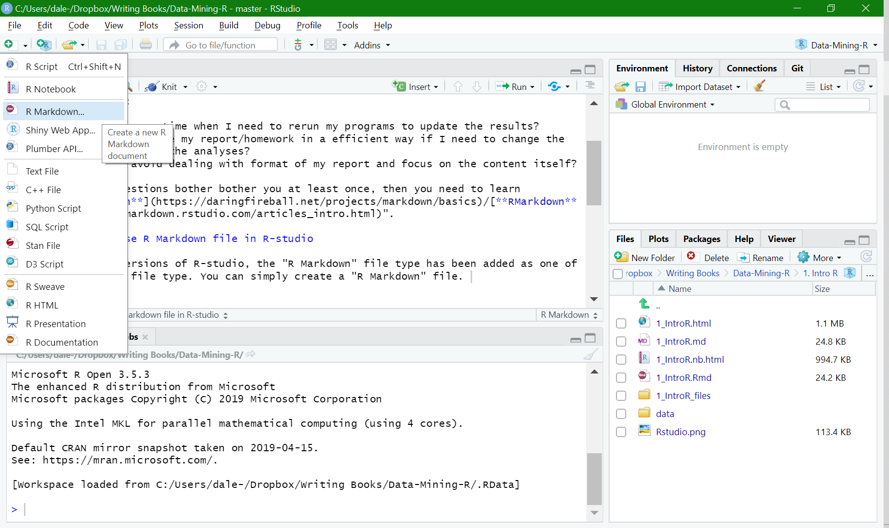
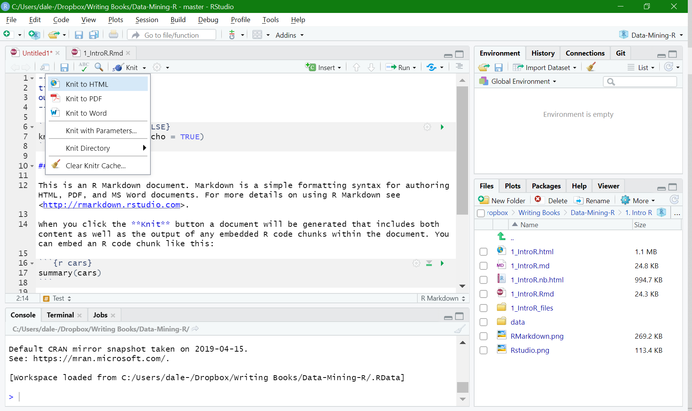

# Life is short! {.center .incremental}


## Don't you want to save a little bit of time for your hobbies? {.bigger}

# You may have these headaches: {.center .incremental}

> - How can I organize my report and calculations?
> - Answer: Open two Word and RStudio side-by-side?
> - How can I efficiently rewrite my report/homework if the analyses changed?
> - Answer: Run analyses? Copy? Paste?
> - How can I avoid dealing with the format of my report and focus on the content itself?
> - Answer: Leave the messy format alone? 

# You may have these headaches: {.center .incremental}

{width=40%}

$\color{red}{\text{If these questions ever bother you at least once, then you need to ...}}$

# Let RMarkdown do the trick! {.center .bigger .incremental}

[**Markdown**](https://daringfireball.net/projects/markdown/basics)/[**RMarkdown**](https://rmarkdown.rstudio.com/articles_intro.html)

# How to use R Markdown file in RStudio 

The most recent version of R-studio has added the "R Markdown" file type as default. You can create an "R Markdown" file. 

{width=90%}

# From RMarkdown file to HTML/pdf/Word {.incremental}

> - $\color{red}{\text{One click! You can generate by simply clicking the "Knit" button.}}$

> - You can generate three types of files as the report: HTML/pdf/word and have them popped-up. PS: the pdf file generating process require LaTex (such as [MikTex](https://miktex.org/)) installed and your codes do not have bugs :-) 

> - {width=100%}


# Markdown Syntax: Simplest way of writing {.incremental}

> - 1. headers - A single hashtag: first-level header. Two hashtags, `##`, creates a second-level header, and so on.

> - 2. italicized and bold text - one asterisk, like this *without realizing it*. Two asterisks, like this, `**easy to use**` **easy to use**.

> - 3. lists - Use asterisks or dash to create bullet points.

> - 4. hyperlinks - create a hyperlink like this [Data-Mining](https://xiaoruizhu.github.io/Data-Mining-R/).

```
# Say Hello to **Data Mining** in Markdown

* [Data Mining in R on Github](https://xiaoruizhu.github.io/Data-Mining-R/)
* [Markdown Syntax](https://daringfireball.net/projects/markdown/basics)
* [StackOverflow](www.stackoverflow.com)
* [Reddit](www.reddit.com)

## R Markdown is a special type of Markdown in R
```

# How to communicate with codes? Use "knitr"

1. `knitr` is an R package that extends the markdown syntax. 
2. One of the most important functions of `knitr` is to include exectuable R code. 
3. Then, with the codes inside the paragraph, the technical report will be more readable than that not including codes. 
4. With `knitr`, the results of executed codes can be automatically included in the output report, which is a great feature.
5. This feature makes your analyses "reproducible". 
6. In this way, you can easily change your codes. Then, when you `knit`, the the results in your output report will be updated with your new codes. 

# How to communicate with codes? Use "knitr"

Here’s some code

```{r}
dim(iris)
```

Here’s a plot

```{r echo=TRUE}
hist(iris[[2]])
```

More settings of the output of code chunks can be found [rmarkdown](https://bookdown.org/yihui/rmarkdown/r-code.html) and [knitr](https://yihui.org/knitr/options/) websites.

# Inline code 

To include some calculation by R code in a line, one can surround the codes as follows: 

> Two plus two equals `r 2+2`. (Use a pair of backticks and the letter r like this: $\color{red}{\text{\` r 2+2 \`}})

[go to top](#header)
