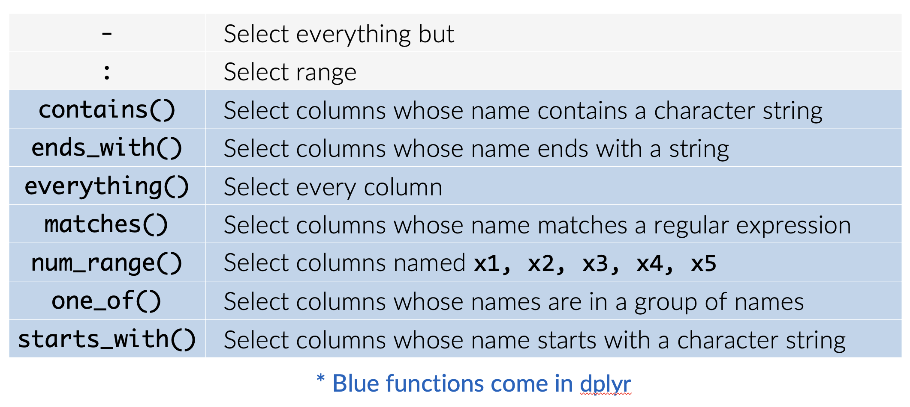

```{r setup, echo=FALSE, include=FALSE}
knitr::opts_chunk$set(eval = TRUE, warning=FALSE, message = FALSE, echo = TRUE)
```

# Why do we need dplyr

1. Making data manipulation easier and more intuitive . 

2. It simplifies the process of data manipulation by providing a consistent grammar for interacting with data. 

3. People can easily filter, arrange, summarize, and extract specific parts of their data without complex code.

# Why do we need dplyr

For example, you have a data frame with information about customers, including their names, ages, spending and satisfaction level. 

You want to filter out customers who are 

1. above a certain **age**, 
2. arrange the data by **grade**, 
3. calculate the **average satisfaction**, 
4. and **extract specific columns** of interest 
5. <span style="color: red;">accomplish these task just a few clear lines of code.</span> 

# Key functions in `dplyr` package

You learned six key dplyr functions that allow you to solve the vast majority of your data manipulation challenges. What do each do?

- filter:
- arrange:
- select:
- mutate:
- summarize: 
- group_by:

# Key functions in `dplyr` package

You learned six key dplyr functions that allow you to solve the vast majority of your data manipulation challenges. What do each do?

- filter: pick observations based on values 
- arrange: reorder data
- select: pick variables
- mutate: create new variables
- summarize: summarize data by functions of choice - group_by: group data by categorical levels


# Details of `dplyr` package and functions

1. Are there vignettes for the dplyr package?
2. Can you find additional documentation explaining the flights data set?

# Details of `dplyr` package and functions

```{r, eval=FALSE}
# are there vignettes for the dplyr package —> yes, 5 of them
vignette(package = "dplyr")
browseVignettes(package = "dplyr")  # shows hyperlinks in browser

# additional documentation for the mpg data set
?flights
```

# Case study: `dplyr` package for the "flights" dataset 

The "flights" dataset in the "nycflights13" R package is a popular dataset containing information about flights departing from New York City airports in 2013. It includes details such as flight dates, departure and arrival times, airlines, distances, and delays.

It's great for exploring patterns in flight data, understanding the factors affecting delays, and building predictive models.

Question for EducateUs: can you briefly explain the "flights" dataset in the "nycflights13" R package?

You will learn six key `dplyr` functions that allow you to solve the vast majority of your data manipulation challenges. 

```{r}
# load packages
library(nycflights13)
library(tidyverse)
# your turn!
```

# Case study: `dplyr` package for the "flights" dataset 

If you want to filter out the flights that are 

1. departure on January of 2013
2. arrange these flights by the departure delay
4. and extract a few specific columns
5. and calculate the flying speed

# The filter() function ---------------------------------------------------

filter() function: filter values based on defined conditions

## Filter based on one or more variables

```{r}
# basic filtering
filter(flights, month == 1)
filter(flights, month == 1, day == 1)
filter(flights, month == 1, day == 1, dep_delay > 0)
```

## Save filtered new data frame

1. Save filter data frame using assignment operator (<-)
2. Save and view filtered data frame by wrapping entire function with ()

```{r}
# save a new data frame
jan1 <- filter(flights, month == 1, day == 1)
(dec25 <- filter(flights, month == 12, day == 25))
```

## logical tests for filtering

```{r, eval=FALSE}
# logical tests
12 == 12
12 <= c(12, 11)
12 %in% c(12, 11, 8)
x <- c(12, NA, 11, NA, 8)
is.na(x)
```

## Using logical tests for filtering

What will these operations produce?

```{r, eval=FALSE}
filter(flights, month == 12)
filter(flights, month != 12)
filter(flights, month %in% c(11, 12))
filter(flights, arr_delay <= 120)
filter(flights, !(arr_delay <= 120))
filter(flights, is.na(tailnum))
```

## multiple logical tests for filtering

```{r, eval=FALSE}
12 == 12 & 12 < 14
12 == 12 & 12 < 10
12 == 12 | 12 < 10
any(12 == 12, 12 < 10)
all(12 == 12, 12 < 10)
```

## multiple comparisons for filtering

```{r, eval=FALSE}
# Using comma is same as using &
filter(flights, month == 12, day == 25)
filter(flights, month == 12 & day == 25)

# Use %in% as a shortcut for |
filter(flights, month == 11 | month == 12)
filter(flights, month %in% c(11, 12))

# Use not operator !
filter(flights, !(arr_delay > 120 | dep_delay > 120))
filter(flights, arr_delay <= 120, dep_delay <= 120)
```

# The filter() exercise: your turn!

Find the number of flights that

a. Had an arrival delay of two or more hours

b. Flew to Houston (IAH or HOU)

c. Arrived more than two hours late, but didn’t leave late

```{r, echo=FALSE, eval=FALSE}
# Solution
# Had an arrival delay of two or more hours
filter(flights, arr_delay >= 120)

# Flew to Houston (IAH or HOU)
filter(flights, dest %in% c("IAH", "HOU"))

# Arrived more than two hours late, but didn’t leave late
filter(flights, arr_delay > 120, dep_delay <= 0)
```

# The arrange() function --------------------------------------------------

arrange() function: reorder data

## ordering data

```{r}
arrange(flights, dep_delay)
arrange(flights, dep_delay, arr_delay)
arrange(flights, desc(dep_delay))
```


## missing values always sorted at the end
```{r}
df <- tibble(x = c(5, 2, 5, NA))
arrange(df, x)
arrange(df, desc(x))
```

# The arrange() exercise: your turn!

1. Sort flights to find those with largest departure delays
2. Find the flights that left earliest based on departure time
3. Which flights traveled the longest distance?
4. Which traveled the shortest?

```{r, echo=FALSE, eval=FALSE}
# Sort flights to find those with largest departure delays
arrange(flights, desc(dep_delay))
# Find the flights that left earliest
arrange(flights, dep_time)
# Which flights travelled the longest?
arrange(flights, desc(distance))
# Which travelled the shortest?
arrange(flights, distance)
```


# The select() function ---------------------------------------------------

Select variables of concern

## selecting variables
```{r}
select(flights, year, month, day)
select(flights, year:day)
select(flights, -(year:day))
```


# Helper functions with the select() function

<center>
  {width=50%}
</center>


```{r}
select(flights, ends_with("time"))
select(flights, c(carrier, ends_with("time"), contains("delay")))
select(flights, time_hour, air_time, everything())
```

# The select() function: your turn!

1. What happens if you include the name of a variable multiple times in a select() call?

2. What does the one_of() function do? Why might it be helpful in conjunction with this vector? 

`vars <- c("MONTH", "month", "day", "dep_delay", "arr_delay")`

3. Does the result of running the following code surprise you? How do the select helpers deal with case by default? How can you change that default?

```{r, eval=FALSE, echo=FALSE}
# Solution
# 1. what happens if you call a variable multiple times in select()
select(flights, month, month)

# 2. what does one_of() do?
vars <- c("MONTH", "month", "day", "dep_delay", "arr_delay")
select(flights, one_of(vars))

# 3. Default for select helpers?
select(flights, contains("TIME"))
```

# The rename() function

```{r}
rename(flights, ANNOYING = dep_delay)
```

# The mutate() function ---------------------------------------------------

Create new variables with functions of existing variables

# The mutate() function: create new variables based on existing variables

mutate() creates new variables with functions of existing variables:

```{r}
# create a smaller data set to work with
flights_sml <- select(
  flights, 
  year:day, 
  ends_with("delay"), 
  distance, 
  air_time
)
flights_sml

mutate(flights_sml,
       # arr_delay=arr_delay, dep_delay=dep_delay,
       hours = air_time / 60,
       gain = arr_delay - dep_delay,
       speed = distance / air_time * 60,
       gain_per_hour = gain / hours)
```

# transmute() function: only keep new variables

If you only want to keep the new variables use transmute():

```{r}
transmute(
  flights,
  gain = arr_delay - dep_delay,
  hours = air_time / 60,
  gain_per_hour = gain / hours
)
```

# The mutate() exercise: your turn!

1. Create a new variable distance_km that converts distance in miles to kilometers

2. Create a time_per_km variable based on air_time and distance_km.

```{r, eval=FALSE, echo=FALSE}
transmute(flights, 
          distance_km = distance * 1.60934,
          time_per_km = air_time / distance_km)
```

# The summarize() or summarise() function ---------------------------------

Collapse many values down to a single summary statistic

# summarizing data

```{r}
summarise(flights, dep_delay_mean = mean(dep_delay, na.rm = TRUE))

summarise(flights, 
          dep_delay_mean = mean(dep_delay, na.rm = TRUE),
          dep_delay_sd = sd(dep_delay, na.rm = TRUE))

summarise(flights, 
          dep_delay_mean = mean(dep_delay, na.rm = TRUE),
          dep_delay_sd = sd(dep_delay, na.rm = TRUE),
          n = n())
```


# The group_by() function ---------------------------------

```{r}
by_day <- group_by(flights, year, month, day)
summarise(by_day, delay = mean(dep_delay, na.rm = TRUE))
```

# The group_by() exercise:  your turn!

1. Which carrier had the largest mean departure delay? Smallest?
2. Which carrier had the largest difference between their max and min departure delay?
3. Which month has the largest standard deviation for arrival delays?

```{r, eval=FALSE, echo=FALSE}
# Which carrier had the largest mean departure delay? Smallest?
by_carrier <- group_by(flights, carrier) 
summarise(by_carrier, delay = mean(dep_delay, na.rm = TRUE))

# Which carrier had the largest difference between their max and min departure delay?
summarise(by_carrier,
max = max(dep_delay, na.rm = TRUE),
min = min(dep_delay, na.rm = TRUE), delta = max - min)

# Which month has the largest variance for arrival delays?
by_month <- group_by(flights, month)
summarise(by_month, delay = sd(arr_delay, na.rm = TRUE))

```


# The pipe operator %>% 

Recall the tasks we discussed. If you want to filter out the flights that are 

1. departure on January of 2013
2. arrange these flights by the departure delay
4. and extract a few specific columns
5. and calculate the flying speed

```{r}
sel_flights <- flights %>%
  # Extract flights departing in January 2013
  filter(month == 1, year == 2013) %>%
  
  # Arrange the flights by departure delay
  arrange(dep_delay) %>%
  
  # extract a few specific columns
  select(year:day, dep_time, arr_time, dep_delay, distance, air_time) %>%
  
  # Calculate the flying speed as distance divided by air_time
  mutate(flying_speed = distance / air_time)

# View the resulting dataset with extracted flights and calculated metrics
print(sel_flights)
```

If these are separate tasks, it should not be too hard. But what if you need to conduct all these tasks all at once, how can you efficiently do it and organize the codes. 

[go to top](#header)
