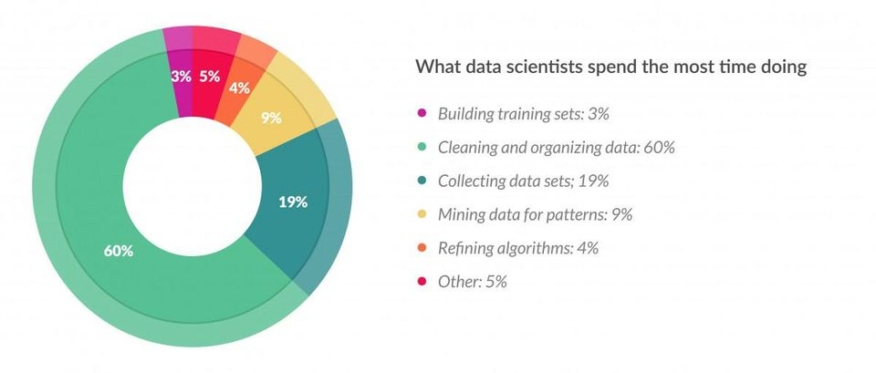

# Importance of Data Wrangling! {.center .bigger .incremental}

{width=50%}

> "Unless the data is something I’ve analyzed a lot before, I usually feel like the blind men and the elephant."
> -- Jeff Leek


# Most Time-Consuming Data Science Task: Data Cleaning (80% of the work)

[**Data preparation** accounts for about 80% of the work of data scientists](https://www.forbes.com/sites/gilpress/2016/03/23/data-preparation-most-time-consuming-least-enjoyable-data-science-task-survey-says/#6a089d126f63)

{width=80%}

# Data Cleaning: ensure $\color{red}{\text{reliability}}$ and $\color{red}{\text{quality}}$ 
In business analytics, data comes from various sources such as databases, spreadsheets, and external sources. These sources often contain missing values, duplicate entries, outliers, and formatting inconsistencies, which can strongly skew the analysis results and lead to incorrect business decisions if not addressed properly.

Data cleaning is a crucial step in the process of preparing data for analysis in the field of business analytics. It involves *identifying and correcting* errors, inconsistencies, and inaccuracies in the dataset to ensure its **reliability** and **quality**. 

# Data cleaning is a crucial step

> It is important and time-consuming, 
>
> but, do you enjoy data cleaning? 

# Example 1

The following two datasets are the raw and clean data. The Raw dataset contains the headers and other information that triggers missing values. Without cleaning, it cannot be directly used. On the contrary, the clean dataset presented right after has the rows and colomns clearly stroed. 

```{r cols.print=3, rows.print=3, message=FALSE}
# install.packages("readxl")
Retail <- readxl::read_xlsx(path = "data/RetailSales2018.xlsx")
head(Retail)
Retail_clean <- readxl::read_xlsx(path = "data/RetailSales2018_clean.xlsx")
Retail_clean
```

Data sources: [Retail Sales Raw Data](https://xiaorui.site/Data-Mining-Business-Analytics/lab/data/RetailSales2018.xlsx) and [Retail Sales Clean Data](https://xiaorui.site/Data-Mining-Business-Analytics/lab/data/RetailSales2018_clean.xlsx)


```{r echo=FALSE, eval=FALSE, cols.print=3, rows.print=3}
# Store the data in a conveniently named variable
Sales <- Retail_clean$Sales
# Figure 1.2
plot(Sales, type = "l")

# head(Retail_clean)
# Change to Time-Series Object
library(zoo)
Retail_Sales <- ts(Retail_clean$Sales, start = as.yearmon("1992-01"), freq = 12)
head(Retail_Sales)

# install.packages("forecast")
require("forecast")
plot(Retail_Sales)

# Produce the seasonal plot of the last 4 years. We use the function seasonplot from the forecast package
z <- window(Retail_Sales, start=c(2011,1))
seasonplot(z)
```

```{r, eval=FALSE, echo=FALSE}
# Figure 1.3
Sales_adj <- Retail_clean$Sales / Retail_clean$S_Factor
plot(Sales_adj, type = "l")

# Figure 1.5
Sales_MOM <- (Sales_adj-quantmod::Lag(Sales_adj, k=1))/quantmod::Lag(Sales_adj, k=1)
Sales_MOM2 <- ts(Sales_MOM, start = as.yearmon("1992-01"), freq = 12)
Sales_MOM3 <- window(Sales_MOM2, start=c(2001,1))
plot(Sales_MOM3, type = "l")

# Figure 1.6
Sales_YOY <- (Sales_adj-quantmod::Lag(Sales_adj, k=12))/quantmod::Lag(Sales_adj, k=12)
Sales_YOY2 <- ts(Sales_YOY, start = as.yearmon("1992-01"), freq = 12)
Sales_YOY3 <- window(Sales_YOY2, start=c(2001,1))
plot(Sales_YOY3, type = "l")
```


# Data Wrangling in R {.bigger .incremental}

In R programming language, data wrangling skills are essential for efficiently manipulating and preparing data for analysis. Some important data wrangling skills in R include:

1. Data Importing
2. Data Cleaning
3. Data Transformation
4. Data Manipulation
5. Data Visualization
6. Handling Dates and Times
7. Handling Strings
8. Looping and Conditional Statements
9. Error Handling
10. Efficient Coding Practices

By performing thorough data cleaning, business analysts can improve the quality and reliability of their analyses, leading to more accurate insights and better-informed business decisions. It lays the foundation for successful data analysis and ensures that businesses can trust the results derived from their data-driven initiatives.

# Data Importing { .bigger .incremental}

R supports the importing from various sources such as CSV files, Excel spreadsheets, databases (e.g., MySQL, PostgreSQL), web APIs, and other formats.

| Option           | Function                                    |  Speed in seconds|
|---------------|---------------------------------|--------------------|
| Base R            | `read.csv("data/flights.csv")`                | ~ 4 seconds|
| `library(readr)`  | `read_csv("data/flights.csv")`            | ~ 0.8 seconds |
| `library(data.table)`     | `fread("data/flights.csv")`           | ~ 0.3 seconds |
| `library(readxl)`     | `read_excel()`           |  |
| Database: `library(DBI)`     | `dbSendQuery()`           |  |
| Web APIs: `library(httr)`     | `GET(url = NULL,...)`           |  |


# What about other flat files? {.center .bigger .incremental}

{width=70%}

# Examples: `read.csv()` and `read_excel()`

We focus on `read.csv()` function to read in .csv files, and `read_excel()` to read in .xlsx files. 

1. Example 1: Importing data from a CSV file ([Auto.csv](https://xiaorui.site/Data-Mining-Business-Analytics/lecture/data/Auto.csv))
```{r}
Auto <- read.csv("data/Auto.csv")
# View(Auto)
head(Auto)
```

2. Example 2: Importing data from an Excel spreadsheet ([RetailSales2018_clean.xlsx](https://xiaorui.site/Data-Mining-Business-Analytics/lecture/data/RetailSales2018_clean.xlsx))

```{r}
library(readxl)
Retail <- read_xlsx(path = "data/RetailSales2018.xlsx")
head(Retail)
```

# Data Cleaning

Skills to clean and preprocess data, which may involve handling missing values (`NA`), removing duplicates, converting data types, dealing with outliers, and detecting and correcting errors in the dataset using functions like `na.omit()`, `complete.cases()`, `duplicated()`, and various functions from the `dplyr` and `tidyr` packages.

## Example 1: Removing useless rows

```{r}
Retail2 <- Retail[-c(1:4),]
head(Retail2)
# Change colomn names
names(Retail2) <- as.character(Retail2[1, ])
Retail2 <- Retail2[-1, ]
Retail2[1:3,]
```

## Example 2: Handling missing values
```{r}
clean_Retail <- na.omit(Retail2)
dim(clean_Retail)
```

## Example 3: Removing duplicates:

```{r}
clean_Retail2 <- clean_Retail[!duplicated(clean_Retail), ]
dim(clean_Retail2)
```

# Data Transformation

Ability to transform data by creating new variables, reshaping data from wide to long format (and vice versa), and summarizing data using functions like `mutate()`, `select()`, `filter()`, `arrange()`, `group_by()`, `summarize()` from the `dplyr` package, and functions like `pivot_longer()` and `pivot_wider()` from the `tidyr` package.

# Data Manipulation

Skills to perform various data manipulation tasks such as merging/joining datasets, splitting data into subsets, and reshaping data using functions like `merge()`, `join()`, `split()`, `reshape()`, `rbind()`, `cbind()`.

# Data Visualization

For quick data exploration, base R plotting functions can provide an expeditious and straightforward approach to understanding your data. Data visualization skills are the abilities to visualize data to explore patterns, relationships, and trends using functions like `ggplot2` for creating sophisticated and customizable plots, `plot()` for basic plots, and `ggplotly()` from the `plotly` package for interactive plots.

{width=50%}

# Handling Dates and Times

Skills to work with date and time data, including parsing, formatting, extracting components (e.g., year, month, day), and performing date arithmetic using functions like `as.Date()`, `as.POSIXct()`, `strftime()`, `strptime()`, `lubridate` package.

# Handling Strings

Ability to manipulate and process character strings, including pattern matching, substring extraction, and string manipulation using functions like `grep()`, `sub()`, `gsub()`, `strsplit()`, and `stringr` package.

# Looping and Conditional Statements

Understanding of control structures like loops (`for`, `while`) and conditional statements (`if`, `else`, `ifelse`) to automate repetitive tasks and apply conditional operations on data.

# Error Handling

Skills to handle errors and exceptions that may occur during data wrangling operations, including debugging techniques and using functions like `tryCatch()`.

# Efficient Coding Practices

Familiarity with efficient coding practices such as vectorization, using R's apply family of functions (`apply()`, `lapply()`, `sapply()`, `vapply()`, `mapply()`), and leveraging the capabilities of packages like `dplyr` and `tidyr` for faster and more concise code.

These skills are crucial for effectively managing and preparing data for analysis and visualization tasks in R. Continuous practice and exploration of R packages and functions related to data wrangling will enhance proficiency in handling diverse datasets and extracting meaningful insights.

# Time to flex our new knowledge muscles!

{width=60%}

Let's apply what you've learned to a real case. 

[go to top](#header)
