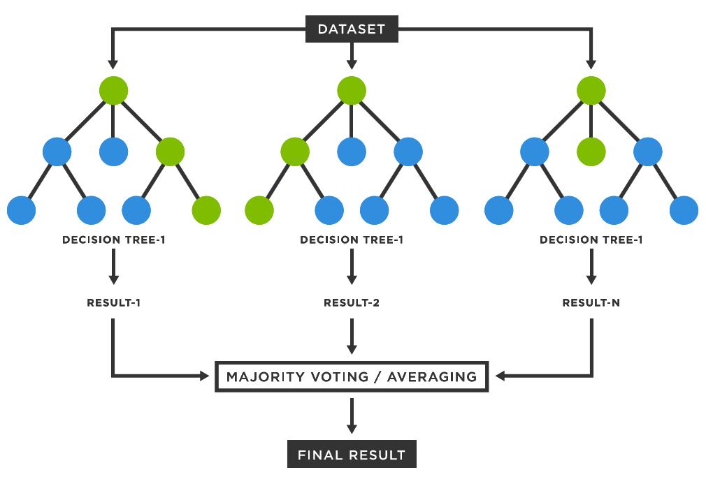
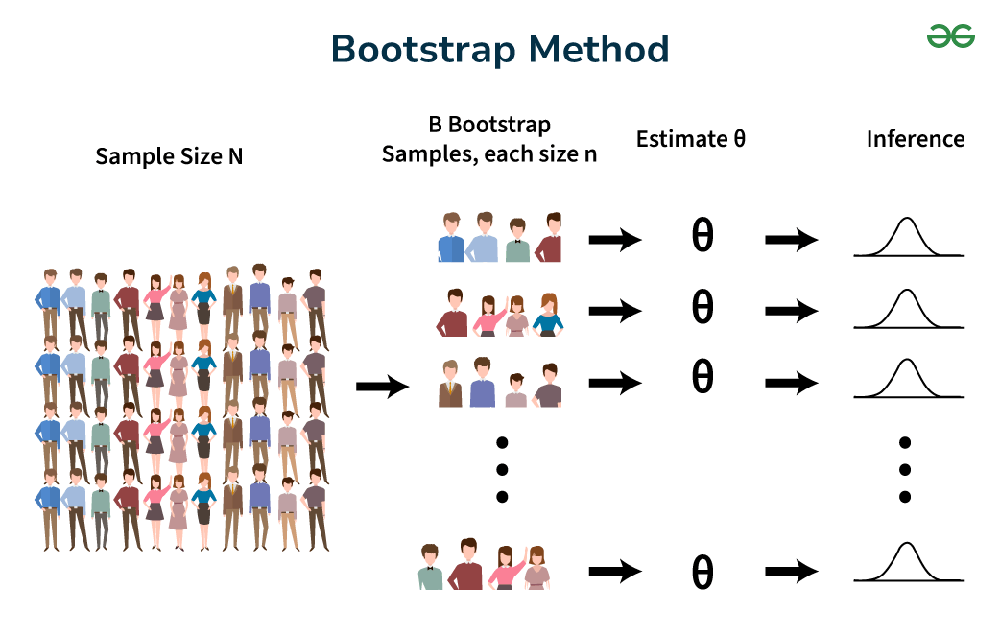

```{r echo=FALSE, eval=TRUE}
knitr::opts_chunk$set(echo = TRUE, 
                      # results='asis',
                      eval = FALSE, warning = FALSE, message = FALSE)
```

# Ensemble Learning {.bigger .incremental}

- A single decision tree is easy to interpret
- But a single tree often has **high variance**
- Small changes in the training sample can lead to a very different tree
- **Ensemble methods** combine many models to improve prediction accuracy
- **Random forest** is one of the most popular ensemble tree algorithms

# Why Do We Need Random Forest? {.bigger .incremental}

- Decision trees are flexible and intuitive
- However, deep trees can overfit the training data
- Pruned trees reduce overfitting but may lose predictive power
- Random forest improves performance by:
  - averaging many trees
  - reducing variance
  - adding randomness to develope many trees that capture different aspects of samples

# What Is Random Forest? {.bigger .incremental}

- **Random forest** is an ensemble method built from many decision trees
- Proposed by [**Leo Breiman (2001)**](https://en.wikipedia.org/wiki/Leo_Breiman) ([his great works](https://scholar.google.com/citations?user=mXSv_1UAAAAJ&hl=en))
- For **classification**:
  - each tree votes for a class
  - the forest predicts the majority class
- For **regression**:
  - each tree makes a numeric prediction
  - the forest predicts the average across trees

# Main Idea 1 {.bigger .incremental}

- Build many trees instead of one tree

{width=60%}^[https://medium.com/@denizgunay/random-forest-af5bde5d7e1e]

<!-- $$ -->
<!-- \hat{f}_{RF}(x)=\frac{1}{B}\sum_{b=1}^{B}\hat{f}^{(b)}(x) -->
<!-- $$ -->

# Main Idea 2 {.bigger .incremental}

- Build many trees instead of one tree
- Each tree is trained on a different bootstrap sample
- The final prediction is aggregated across trees

{width=60%}^[https://www.geeksforgeeks.org/maths/bootstrap-method/]

<!-- # Step 1: Bootstrap Sampling {.bigger .incremental} -->

<!-- - Start with a training data set of size $n$ -->
<!-- - Draw a bootstrap sample of size $n$ **with replacement** -->
<!-- - Some observations appear more than once -->
<!-- - Some observations are left out -->
<!-- - The omitted observations are called **out-of-bag (OOB)** observations -->

<!-- # Step 2: Grow a Tree {.bigger .incremental} -->

<!-- - Fit a decision tree to the bootstrap sample -->
<!-- - Unlike CART for interpretation, trees in random forest are usually grown **deep** -->
<!-- - Trees are typically **not pruned** -->
<!-- - This makes each individual tree low-bias but high-variance -->
<!-- - Averaging across many trees then reduces the variance -->

<!-- # Step 3: Random Predictor Selection {.bigger .incremental} -->

<!-- - At each split, do **not** examine all predictors -->
<!-- - Randomly select only $m$ predictors from the full set of $p$ predictors -->
<!-- - Then choose the best split only from those $m$ predictors -->
<!-- - This extra randomness makes the trees less similar to one another -->

<!-- # Why Random Predictor Selection Helps {.bigger .incremental} -->

<!-- - Suppose one predictor is extremely strong -->
<!-- - In bagging, that same predictor may dominate the top split of many trees -->
<!-- - Then the trees become highly correlated -->
<!-- - Correlated trees do not reduce variance very much when averaged -->
<!-- - Random feature selection forces different trees to explore different structures -->

<!-- # Bagging versus Random Forest {.bigger .incremental} -->

<!-- - **Bagging**: -->
<!--   - bootstrap samples -->
<!--   - each split considers **all** predictors -->
<!-- - **Random forest**: -->
<!--   - bootstrap samples -->
<!--   - each split considers only a **random subset** of predictors -->
<!-- - Therefore random forest usually outperforms bagging when predictors are correlated -->

# Important Tuning Parameters {.bigger .incremental}

- `ntree`: number of trees in the forest
- `mtry`: number of predictors considered at each split
- `nodesize`: minimum number of cases in terminal nodes
- `sampsize`: size of bootstrap samples

<!-- # Choosing `mtry` {.bigger .incremental} -->

<!-- - A common default for classification is -->

<!-- $$ -->
<!-- mtry=\sqrt{p} -->
<!-- $$ -->

<!-- - A common default for regression is -->

<!-- $$ -->
<!-- mtry=p/3 -->
<!-- $$ -->

<!-- - Smaller `mtry` increases randomness -->
<!-- - Larger `mtry` makes trees more similar -->
<!-- - Best value is usually selected empirically -->

# Variable Importance {.bigger .incremental}

- Random forest can rank predictors by importance
- Two common measures:
  - **Mean decrease in accuracy**
  - **Mean decrease in Gini**
- Important predictors contribute more to predictive performance
- Variable importance is useful for interpretation, screening, and feature selection

# Advantages of Random Forest {.bigger .incremental}

- Usually delivers strong predictive accuracy
- Handles nonlinear relationships automatically
- Captures interactions among predictors
- Works well with many predictors
- Robust to noise and outliers
- Provides OOB error and variable importance

# Limitations of Random Forest {.bigger .incremental}

- Harder to interpret than a single decision tree
- May require more computation time
- Can be less transparent for managerial decision rules
- Variable importance can be biased in some settings
- Not ideal when a simple, explainable rule is the main goal

# A Real World Example {.bigger .incremental}

- Suppose a bank wants to predict whether a customer will respond to a marketing offer
- A single classification tree might split on:
  - age
  - income
  - credit score
- A random forest builds many alternative trees based on different bootstrap samples and random subsets of predictors
- The final prediction is based on the combined vote of all trees

# Example with R: Spam Email Classification {.bigger .incremental}

- Suppose we would like to classify whether an email is spam
- The data set contains:
  - `Spam`: target variable
  - several predictor variables such as `Recipients`, `Hyperlinks`, and `Characters`
- We will:
  - split the data into training and test sets
  - fit a random forest classifier
  - evaluate predictive accuracy
  - examine variable importance

# Load Packages and Data

```{r eval=TRUE}
library(readr)
library(randomForest)
library(pROC)
# Import the Spam.csv dataset and name it as "emails"

emails <- read_csv("Spam.csv")
head(emails)
# Make sure the response variable is a factor for classification
emails$Spam <- as.factor(emails$Spam)
```

# Split into Training and Test Sets

```{r eval=TRUE}
set.seed(123)

train_index <- sample(1:nrow(emails), 0.7 * nrow(emails))
train_data <- emails[train_index, ]
test_data  <- emails[-train_index, ]
```

# Fit a Random Forest Classifier

```{r eval=TRUE}
rf_model <- randomForest(
  Spam ~ Hyperlinks + Characters + Recipients, 
  data = train_data,
  ntree = 500,
  importance = TRUE
)

rf_model
```

# Interpreting the Output {.bigger .incremental}

- The printed output typically includes:
  - OOB estimate of error rate
  - confusion matrix for the training sample using OOB predictions
  - number of trees grown
  - number of variables tried at each split
- Smaller OOB error indicates better predictive performance

# Predict on Training and Test Sets

```{r eval=TRUE}
train_pred <- predict(rf_model, newdata = train_data)
test_pred  <- predict(rf_model, newdata = test_data)
```

# Accuracy and Confusion Matrix

```{r eval=TRUE}
library(caret)
train_accuracy <- 
  confusionMatrix(data = train_pred, 
                  reference = train_data$Spam, 
                  positive = "1")

test_accuracy <- 
  confusionMatrix(data = test_pred, 
                  reference = test_data$Spam, 
                  positive = "1")

train_accuracy
test_accuracy
```

# Predicted Probabilities and ROC Curve

```{r eval=TRUE}
test_prob <- predict(rf_model, newdata = test_data, type = "prob")[, 2]

roc_obj <- roc(response = test_data$Spam, predictor = test_prob)
plot(roc_obj)
auc(roc_obj)
```

- The ROC curve evaluates classification performance across all thresholds
- A larger AUC indicates better overall discriminatory power

# Variable Importance in R

```{r eval=TRUE}
importance(rf_model)
varImpPlot(rf_model)
```

- Predictors with larger importance values have greater influence on prediction

<!-- # Tuning `mtry` with `tuneRF()` -->

<!-- ```{r eval=FALSE} -->
<!-- set.seed(123) -->

<!-- tuned_model <- tuneRF( -->
<!--   x = subset(train_data, select = -Spam), -->
<!--   y = train_data$Spam, -->
<!--   stepFactor = 1.5, -->
<!--   improve = 0.01, -->
<!--   ntreeTry = 300, -->
<!--   trace = TRUE, -->
<!--   plot = TRUE -->
<!-- ) -->
<!-- ``` -->

<!-- - This helps identify a good value for `mtry` -->

# Example Prediction for a New Email

```{r eval=FALSE}
new_email <- data.frame(
  Recipients = 8,
  Hyperlinks = 12,
  Characters = 3500
)

predict(rf_model, newdata = new_email)
predict(rf_model, newdata = new_email, type = "prob")
```

- The first line gives the predicted class
- The second line gives predicted class probabilities

# Example with R: Regression Random Forest for HELOC Balance Prediction {.bigger .incremental}

- Random forest also works for continuous outcomes
- For example, `Balance` is a numeric target variable
- The goal is to predict balances using several predictors, which will help to identify high-value customers who routinely maintain high balances. 

# Fit a Regression Random Forest

```{r eval=TRUE}
library(readxl)
# Import the HELOC_Balance dataset from Excel
HELOC_Balance <- read_excel("HELOC_Balance.xlsx")

# Using the "createDataPartition()" function in the "caret" package
# Split the dataset: 70% training, 30% validation
library(caret)
myIndex <- createDataPartition(HELOC_Balance$Balance, p = 0.7, list = FALSE)
trainSet <- HELOC_Balance[myIndex, ]
validationSet <- HELOC_Balance[-myIndex, ]

# Set seed for reproducibility again before tree building
set.seed(1)

library(randomForest)

rf_balance_reg <- randomForest(
  Balance ~ ., 
  data = trainSet,
  ntree = 500,
  importance = TRUE
)

rf_balance_reg
```

# Regression Prediction and RMSE

- Using the function `accuracy()` in the package `library(forecast)`

```{r eval=TRUE}
rf_reg_test_pred <- predict(rf_balance_reg, newdata = validationSet)

library(forecast)
rf_reg_test_perf <- accuracy(object = rf_reg_test_pred, validationSet$Balance)
rf_reg_test_perf

```

- For regression problems, smaller RMSE indicates better predictive accuracy

# Comparison: CART versus Random Forest {.bigger .incremental}

| Aspect | CART | Random Forest |
| --- | --- | --- |
| Number of trees | One | Many |
| Interpretability | High | Lower |
| Variance | High | Lower |
| Predictive accuracy | Moderate | Often high |
| Overfitting risk | Higher | Lower |
| Variable importance | Limited | Built-in |

# When Should We Use Random Forest? {.bigger .incremental}

- When prediction accuracy is more important than simple interpretation
- When there are many predictors and possible interactions
- When the relationship between predictors and outcome is nonlinear
- When a single tree is too unstable

# When Might CART Be Preferred? {.bigger .incremental}

- When you need simple if-then decision rules
- When interpretability is critical for managers or policy makers
- When communicating the model structure matters more than gaining a small improvement in accuracy

# Key Takeaways {.bigger .incremental}

- Random forest is an ensemble of many decision trees
- It uses both **bootstrap sampling** and **random predictor selection**
- It reduces variance and usually improves prediction accuracy
- It can handle both classification and regression tasks
- OOB error and variable importance are two major practical strengths

# Practice Exercise {.bigger .incremental}

1. Fit a random forest model to the spam data
2. Change `ntree` from 200 to 800 and compare results
3. Tune `mtry` and compare the OOB error
4. Compare random forest with logistic regression and CART
5. Identify the three most important predictors

# Another Useful Package: `caret` {.bigger .incremental}

```{r eval=FALSE}
library(caret)

control <- trainControl(
  method = "cv",
  number = 5,
  classProbs = TRUE
)

grid <- expand.grid(mtry = c(2, 3, 4, 5))

rf_caret <- train(
  Spam ~ ., 
  data = train_data,
  method = "rf",
  trControl = control,
  tuneGrid = grid,
  ntree = 500
)

rf_caret
```

# Summary {.bigger .incremental}

- Random forest is one of the most effective general-purpose machine learning algorithms
- It performs especially well when:
  - prediction is the main objective
  - the data may contain nonlinearities and interactions
  - a single tree is too unstable
- The tradeoff is that the model is less interpretable than CART
