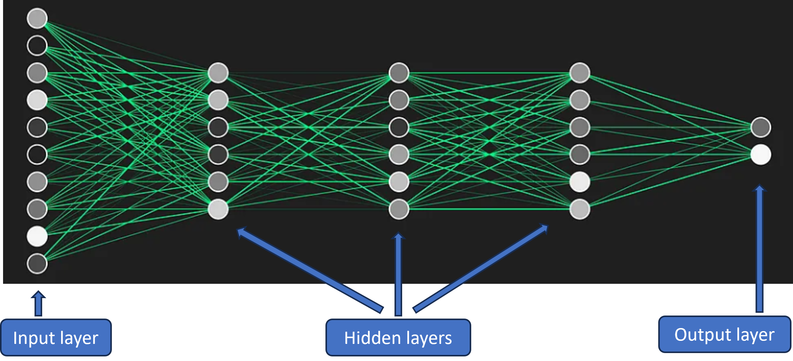
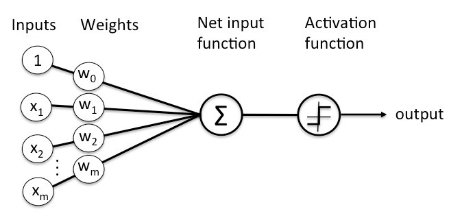
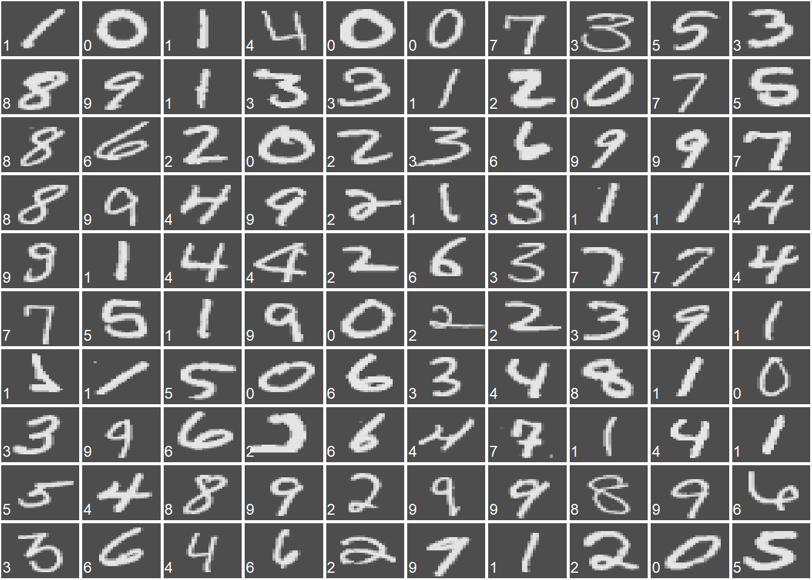
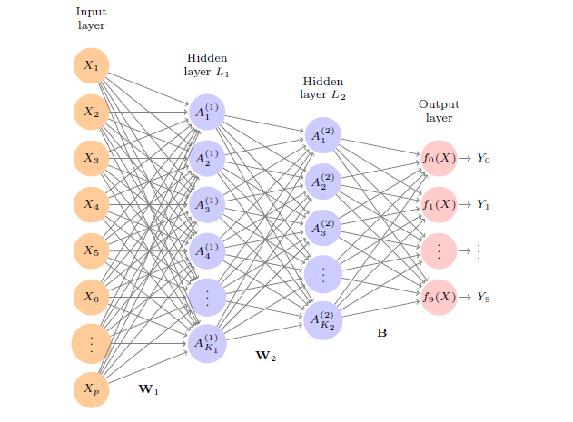

# Human Brain {.bigger .incremental}

{width=80%}   

# Human Brain {.bigger .incremental}

- Receive inputs
- Process electrical and chemical signals
- Neuron switching time is approximately `0.001` second
- Number of neurons is approximately `10^11`
- Connections per neuron are approximately `10^4` to `10^5`
- Scene recognition time is approximately `0.1` second
- The brain performs massive parallel computation

- Animation: [How Neurons Communicate](https://youtu.be/hGDvvUNU-cw?si=Ll2P6WdkI0aI_iXJ)

# Artificial Neural Network {.bigger .incremental}

{width=60%}  

- An artificial neural network is inspired by how neurons interact in the brain
- Each edge in the network represents a **weight**
- Each node represents a **univariate function**
- Information flows from the input layer through one or more hidden layers to the output layer

- Animation: [A neural network model that can identify digits](https://www.educateusgpt.org/sec-1-1-overview.html)

# How the System Works {.bigger .incremental}

Helpful video: [3Blue1Brown Neural Networks](https://www.youtube.com/watch?v=aircAruvnKk)

# A Simple Neural Network: Perceptron {.bigger .incremental}

{width=80%}  

- It is equivalent to **linear regression** when:
  - the response is continuous, and
  - the activation function is the identity function
- It is equivalent to **logistic regression** when:
  - the response is binary, and
  - the activation function is the sigmoid function

# Example: MNIST Data {.bigger .incremental}

{width=55%}  

- MNIST is a well-known image classification data set
- Each grayscale image has `28 x 28 = 784` pixels
- Each pixel stores the darkness level of that location
- The goal is to classify the image into one of the digits `0` through `9`
- The data set contains:
  - `60,000` training images
  - `10,000` test images

# A Neural Network for MNIST {.bigger .incremental}

{width=80%}

# A Neural Network for MNIST {.bigger .incremental}

- Input layer: `p = 784` units
- Hidden layer 1: `K_1 = 256` units
- Hidden layer 2: `K_2 = 128` units
- Output layer: `10` units for the 10 digit labels

{width=50%}

# A Neural Network for MNIST {.bigger .incremental}

- Input layer: `p = 784` units
- Hidden layer 1: `K_1 = 256` units
- Hidden layer 2: `K_2 = 128` units
- Output layer: `10` units for the 10 digit labels

{width=50%}

- This network has a very large number of parameters, How many?
- Neural networks become powerful because they can capture highly complex nonlinear relationships
- But they can also overfit if not trained carefully

# Other Deep Neural Networks {.bigger .incremental}

- **Convolutional Neural Networks (CNNs)**
- **Recurrent Neural Networks (RNNs)**
- **Generative neural networks**
- Recommended reading: [Deep Learning article in Nature](https://www.nature.com/articles/nature14539)

# Example with R: A Simple Neural Network for Classification {.bigger .incremental}

- We use the `nnet` package for a basic neural network classifier
- Suppose we want to predict whether an email is spam
- This example uses a small feedforward neural network with one hidden layer

# Load Packages and Data

```{r eval=FALSE}
library(readr)
library(nnet)

myData <- read_csv("Spam.csv")
myData$Spam <- as.factor(myData$Spam)
```

# Split the Data

```{r eval=FALSE}
set.seed(123)

train_index <- sample(1:nrow(myData), 0.7 * nrow(myData))
train_data <- myData[train_index, ]
test_data  <- myData[-train_index, ]
```

# Fit a Neural Network Classifier

```{r eval=FALSE}
nn_model <- nnet(
  Spam ~ ., 
  data = train_data,
  size = 5,
  decay = 0.01,
  maxit = 500,
  trace = FALSE
)

nn_model
```

- `size = 5` means there are 5 hidden units
- `decay` adds regularization to reduce overfitting
- `maxit` is the maximum number of iterations

# Predict on Training and Test Sets

```{r eval=FALSE}
train_prob <- predict(nn_model, newdata = train_data, type = "raw")
test_prob  <- predict(nn_model, newdata = test_data, type = "raw")

train_pred <- ifelse(train_prob > 0.5, 1, 0)
test_pred  <- ifelse(test_prob > 0.5, 1, 0)
```

# Evaluate Classification Performance

```{r eval=FALSE}
train_accuracy <- mean(train_pred == as.numeric(as.character(train_data$Spam)))
test_accuracy  <- mean(test_pred == as.numeric(as.character(test_data$Spam)))

train_accuracy
test_accuracy

table(Predicted = test_pred, Actual = test_data$Spam)
```

# ROC Curve and AUC

```{r eval=FALSE}
library(pROC)

roc_obj <- roc(
  response = test_data$Spam,
  predictor = as.numeric(test_prob)
)

plot(roc_obj)
auc(roc_obj)
```

# Example Prediction for a New Observation

```{r eval=FALSE}
new_email <- data.frame(
  Recipients = 8,
  Hyperlinks = 12,
  Characters = 3500
)

predict(nn_model, newdata = new_email, type = "raw")
```

# Example with R: Neural Network for Regression {.bigger .incremental}

- Neural networks can also be used for numerical prediction
- Suppose `Sales` is a continuous response variable

# Fit a Regression Neural Network

```{r eval=FALSE}
library(nnet)

nn_reg <- nnet(
  Sales ~ ., 
  data = train_data,
  size = 5,
  linout = TRUE,
  decay = 0.01,
  maxit = 500,
  trace = FALSE
)

nn_reg
```

- `linout = TRUE` tells `nnet()` to use a linear output for regression

# Evaluate Regression Performance

```{r eval=FALSE}
reg_pred <- predict(nn_reg, newdata = test_data)

rmse <- sqrt(mean((reg_pred - test_data$Sales)^2))
mad  <- mean(abs(reg_pred - test_data$Sales))

rmse
mad
```

# Advantages of Neural Networks {.bigger .incremental}

- High predictive performance
- Can capture complicated nonlinear relationships
- Can automatically represent interactions among variables
- Flexible enough for classification and regression
- Deep learning performs especially well on images, text, and speech

# Weaknesses of Neural Networks {.bigger .incremental}

- Hard to interpret compared with linear regression or decision trees
- Require careful tuning
- Can overfit without regularization or validation
- Often need a large amount of training data
- Training can be computationally expensive

# Key Takeaways {.bigger .incremental}

- Neural networks are flexible predictive models inspired by the brain
- A perceptron is the simplest neural network model
- Hidden layers and activation functions allow the model to learn nonlinear patterns
- Backpropagation and gradient descent are the main tools for training the model
- Neural networks can be used for both classification and regression
- Deep learning extends neural networks to more complex architectures such as CNNs and RNNs
